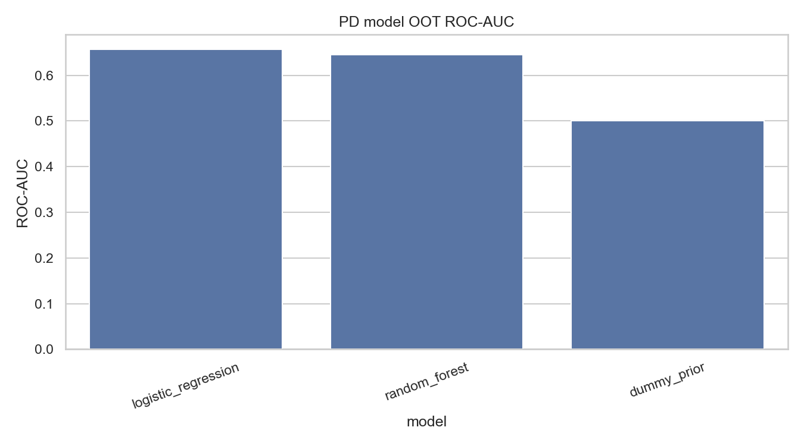
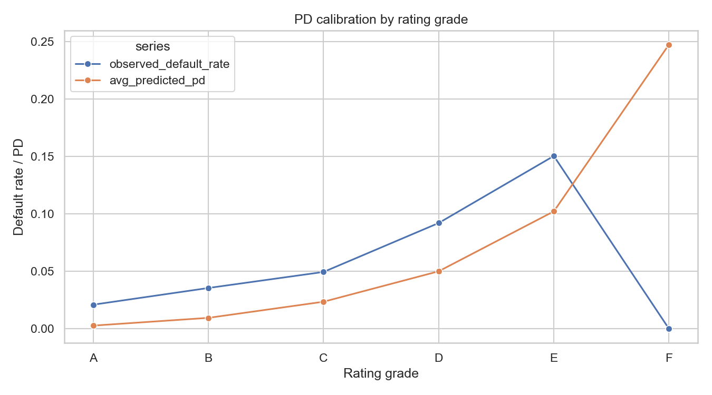
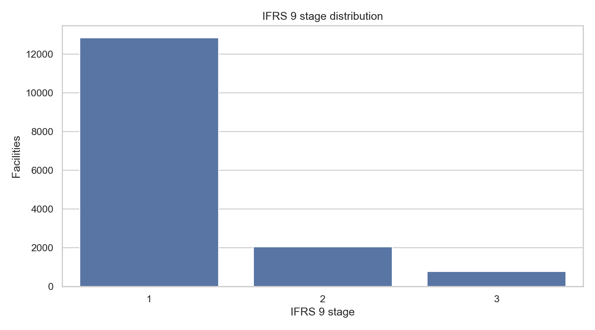
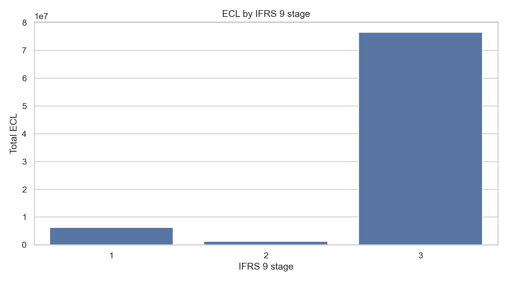
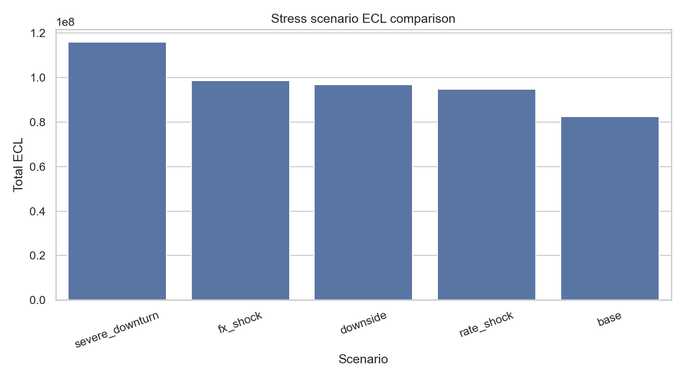
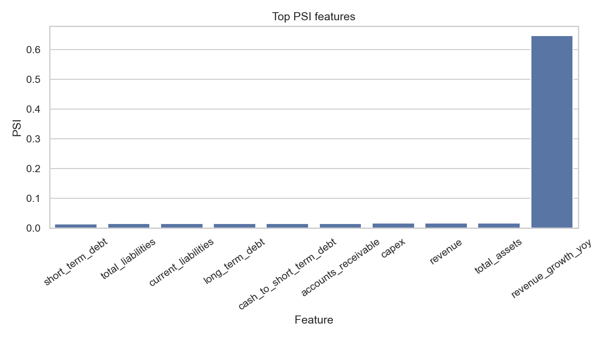

# English version

# IFRS 9 PD/LGD/EAD Modeling

[](https://github.com/burulbash/ifrs9-pd-lgd-ead-modeling/actions/workflows/tests.yml)

End-to-end project for credit risk modeling for an SME/corporate portfolio in the logic of IFRS 9 expected credit loss.

### Credit risk modeling

- PD model for 12-month default risk.
- LGD model based on recoveries, collection costs, collateral and EAD at default.
- EAD / CCF model for revolving and undrawn facilities.
- Internal rating grades based on predicted PD.
- Out-of-time validation.
- Rating backtesting and calibration.

### IFRS 9 impairment logic

- Stage 1 / Stage 2 / Stage 3 assignment.
- Significant increase in credit risk triggers.
- 12-month ECL for Stage 1.
- Lifetime ECL for Stage 2.
- Credit-impaired / default logic for Stage 3.
- Scenario-weighted ECL.
- Stress scenario analysis.

### Validation and monitoring

- ROC-AUC, Gini, KS, Average Precision and Brier Score for PD.
- MAE, RMSE, weighted MAE and weighted RMSE for LGD and EAD/CCF.
- Calibration by rating grade.
- Calibration by decile.
- Rating monotonicity checks.
- PSI stability report.
- Stage distribution monitoring.
- ECL summary reports.
- Stress impact reports.

### Engineering

- PostgreSQL schema and loading scripts.
- SQL marts for modeling samples.
- Python CLI scripts for each modeling step.
- Unit tests for financial ratios, model utilities, staging rules, ECL math, stress scenarios, validation and plots.
- GitHub Actions workflow that runs tests and the sample pipeline.
- Final reports and plots generated on a medium-size synthetic portfolio.

---

## Architecture

The repository is split by areas of responsibility.

```text
database/
  generate raw synthetic data
  define PostgreSQL schema
  load CSV files
  create indexes

sql/
  build financial ratio mart
  build PD modeling sample
  build LGD modeling sample
  build EAD/CCF modeling sample
  build IFRS 9 staging sample

src/
  reusable risk/modeling utilities
  train PD, LGD and EAD/CCF models
  assign IFRS 9 stages
  calculate ECL
  run stress scenarios
  run validation
  generate plots

tests/
  unit tests and smoke tests

outputs/
  generated reports and plots

data/sample/
  small CSV samples used by CI and quick local runs
```

## Data model

The project uses generated SME/corporate data.

Raw tables:

| Table | Meaning |
|---|---|
| `companies` | Company profile at borrower level. |
| `financial_statements` | Annual financial statements of companies. |
| `loan_facilities` | Credit facilities: term loans, credit lines, overdrafts, leasing and trade finance. |
| `collateral` | Collateral type, collateral value and haircuts. |
| `payments` | Payment history, days past due and outstanding balance. |
| `defaults` | Default events and EAD at default. |
| `recoveries` | Post-default recoveries and collection costs. |
| `rating_history` | Internal rating history and PD estimates. |
| `macro_scenarios` | Base, downside, upside and stress macro assumptions. |

Data generation logic connects borrower quality and credit outcomes:

- high leverage increases default risk;
- weak interest coverage increases default risk;
- weak liquidity increases default risk;
- negative revenue growth increases default risk;
- industry stress affects defaults and ratings;
- stronger collateral reduces expected LGD;
- revolving products create the need for EAD/CCF modeling;
- recoveries depend on collateral and default characteristics.

---

## Financial ratios layer

The first modeling layer converts financial statements into credit risk features.

Examples:

```text
current_ratio = current_assets / current_liabilities
quick_ratio = (current_assets - inventory) / current_liabilities
debt_to_equity = total_debt / equity
debt_to_assets = total_debt / total_assets
debt_to_ebitda = total_debt / ebitda
interest_coverage = ebitda / interest_expense
ebitda_margin = ebitda / revenue
net_profit_margin = net_income / revenue
operating_cf_to_debt = operating_cash_flow / total_debt
cash_to_short_term_debt = cash / short_term_debt
equity_to_assets = equity / total_assets
loan_to_value = outstanding_amount / collateral_value
collateral_coverage = collateral_value / outstanding_amount
```

---

## SQL

The SQL layer creates point-in-time modeling samples for each risk component.

| SQL file | Output |
|---|---|
| `01_build_financial_ratios_mart.sql` | Financial ratios and facility-level risk mart. |
| `02_build_pd_modeling_sample.sql` | PD modeling sample with 12-month default target. |
| `03_build_lgd_modeling_sample.sql` | LGD sample for defaulted facilities. |
| `04_build_ead_ccf_modeling_sample.sql` | EAD/CCF sample for revolving defaulted facilities. |
| `05_build_ifrs9_staging_sample.sql` | Portfolio sample for IFRS 9 staging and ECL. |

---

## PD model

The PD model estimates 12-month default probability.

### Target

```text
target_default_12m
```

The target is built from future default events after the observation date.

### Split

The model uses a time-based split:

```text
train → older observation dates
valid → later observation dates
OOT   → newest observation dates
```

### Leakage control

The PD feature set excludes:

- IDs and date columns;
- target columns;
- future performance fields;
- default outcome fields;
- recovery fields;
- existing decision engine outputs;
- suspicious future/outcome-like fields by name.

### Models

The training script compares:

- logistic regression;
- random forest.

### Final medium run result

On the final medium synthetic portfolio:

| Model | Split | ROC-AUC | Gini | KS |
|---|---:|---:|---:|---:|
| Logistic Regression | OOT | 0.657 | 0.314 | 0.255 |
| Random Forest | OOT | 0.646 | 0.291 | 0.225 |
| Dummy Prior | OOT | 0.500 | 0.000 | 0.000 |

---

## Rating grades and calibration

Predicted PD values are converted into internal rating grades:

```text
A → lowest risk
B
C
D
E
F → highest risk
```

The rating validation report checks:

```text
rating grade
facility count
observed defaults
observed default rate
average predicted PD
calibration error
monotonicity
```

Key reports:

```text
outputs/reports/pd_rating_grade_summary.csv
outputs/reports/validation_pd_backtesting_by_rating.csv
outputs/reports/validation_rating_monotonicity_summary.csv
```
---

## LGD model

LGD is modeled only for defaulted facilities, because realized LGD is observed after default.

The project calculates realized LGD as follows:

```text
net_recovery = total_recovery_amount - total_collection_cost

realized_lgd = 1 - net_recovery / ead_at_default
```

The result is clipped to a valid range:

```text
0 <= LGD <= 1
```

Features include:

- collateral type;
- collateral value;
- effective collateral value;
- collateral coverage;
- loan-to-value;
- seniority;
- product type;
- company size;
- industry;
- financial ratios;
- macro fields.

Models:

- ridge regression;
- random forest regressor.

Final medium run:

| Model | Split | MAE | RMSE | Weighted MAE |
|---|---:|---:|---:|---:|
| Random Forest | OOT | 0.090 | 0.114 | 0.105 |
| Ridge | OOT | 0.129 | 0.168 | 0.170 |
| Dummy Mean | OOT | 0.237 | 0.275 | 0.223 |

Key reports:

```text
outputs/reports/lgd_model_metrics.csv
outputs/reports/lgd_calibration_by_decile.csv
outputs/reports/lgd_by_segment.csv
```

---

## EAD / CCF model

For amortizing facilities, exposure is mostly determined by outstanding balance.

The project models CCF for revolving defaulted facilities:

```text
CCF = (ead_at_default - outstanding_amount_at_observation) / undrawn_amount
```

The result is clipped to the range:

```text
0 <= CCF <= 1.5
```

Estimated EAD is calculated as follows:

```text
EAD = outstanding_amount + CCF × undrawn_amount
```

Features include:

- product type;
- limit amount;
- outstanding amount;
- undrawn amount;
- utilization rate;
- revolving flag;
- rating;
- company financial ratios;
- industry;
- collateral;
- macro fields.

Models:

- ridge regression;
- random forest regressor.

Final medium run:

| Model | Split | MAE | RMSE | Weighted MAE |
|---|---:|---:|---:|---:|
| Random Forest | OOT | 0.165 | 0.192 | 0.198 |
| Dummy Mean | OOT | 0.174 | 0.197 | 0.211 |
| Ridge | OOT | 0.209 | 0.302 | 0.446 |

Key reports:

```text
outputs/reports/ead_ccf_model_metrics.csv
outputs/reports/ead_ccf_calibration_by_decile.csv
outputs/reports/ead_ccf_by_product.csv
```

---

## IFRS 9 staging

The staging layer assigns each facility to Stage 1, Stage 2 or Stage 3.

### Stage 1

Performing assets without significant increase in credit risk.

### Stage 2

Assets with significant increase in credit risk.

In this project, Stage 2 can be triggered by the following triggers:

```text
rating downgrade by 2+ notches
current PD / origination PD >= 2
current DPD >= 30
watchlist flag
restructuring flag
```

### Stage 3

Credit-impaired or defaulted assets.

In this project, Stage 3 can be triggered by the following triggers:

```text
default flag
writeoff flag
current DPD >= 90
DPD at default >= 90
```

Final medium run:

| Stage | Facilities | Share | Outstanding share |
|---|---:|---:|---:|
| Stage 1 | 12,834 | 82.0% | 82.9% |
| Stage 2 | 2,038 | 13.0% | 12.7% |
| Stage 3 | 774 | 4.9% | 4.4% |

Key reports:

```text
outputs/reports/ifrs9_stage_distribution.csv
outputs/reports/ifrs9_stage_by_rating.csv
outputs/reports/ifrs9_rating_migration_matrix.csv
```

---

## ECL calculation

The project uses the full IFRS 9 ECL calculation flow.

### Stage logic

```text
Stage 1:
ECL = 12-month PD × LGD × EAD

Stage 2:
ECL = lifetime PD × LGD × EAD

Stage 3:
ECL = 1.0 × LGD × EAD
```

### Lifetime PD approximation

Lifetime PD is approximately calculated as follows:

```text
lifetime_pd = 1 - (1 - annual_pd) ^ remaining_life_years
```

### Scenario-weighted ECL

ECL is calculated by scenarios:

```text
base
downside
upside
```

Then they are combined through scenario weights:

```text
scenario_weighted_ecl =
  0.60 × ECL_base
+ 0.25 × ECL_downside
+ 0.15 × ECL_upside
```

Final medium portfolio summary:

| Metric | Value |
|---|---:|
| Facilities | 15,646 |
| Total EAD | 972.1M |
| Total ECL | 84.1M |
| ECL rate | 8.65% |
| Stage 1 share | 82.0% |
| Stage 2 share | 13.0% |
| Stage 3 share | 4.9% |

ECL by stage:

| Stage | Facilities | Total EAD | Total ECL |
|---|---:|---:|---:|
| Stage 1 | 12,834 | 736.0M | 6.3M |
| Stage 2 | 2,038 | 124.3M | 1.3M |
| Stage 3 | 774 | 111.8M | 76.5M |

Stage 3 gives the largest part of portfolio ECL, because PD = 1.0 is used for defaulted assets.

Key reports:

```text
outputs/reports/ifrs9_ecl_portfolio_summary.csv
outputs/reports/ifrs9_ecl_by_stage.csv
outputs/reports/ifrs9_ecl_by_rating.csv
outputs/reports/ifrs9_ecl_by_industry.csv
outputs/reports/ifrs9_ecl_by_scenario.csv
```

---

## Stress scenarios

The stress module evaluates how portfolio ECL changes under stricter macro assumptions.

Implemented stress scenarios:

```text
base
downside
rate_shock
fx_shock
severe_downturn
```

Stress affects:

- PD multipliers;
- LGD multipliers;
- CCF / EAD multipliers;
- industry-specific sensitivity;
- FX-sensitive industries.

Final medium stress result:

| Scenario | Total ECL | Change vs base |
|---|---:|---:|
| Base | 82.5M | 0.0% |
| Rate shock | 94.8M | +14.9% |
| Downside | 96.7M | +17.2% |
| FX shock | 98.5M | +19.5% |
| Severe downturn | 115.9M | +40.5% |

Key reports:

```text
outputs/reports/stress_scenario_summary.csv
outputs/reports/stress_scenario_by_stage.csv
outputs/reports/stress_scenario_by_industry.csv
```

---

## Validation and monitoring

There is a separate validation runner:

```text
src/run_model_validation.py
```

### PD validation

- OOT ROC-AUC / Gini / KS.
- Rating grade backtesting.
- Calibration by decile.
- Average predicted PD vs observed default rate.
- Rating monotonicity check.

### LGD validation

- MAE and RMSE.
- Weighted MAE and weighted RMSE by EAD.
- Actual vs predicted LGD by decile.
- LGD by segment.

### EAD / CCF validation

- MAE and RMSE.
- Weighted MAE and weighted RMSE by EAD.
- Actual vs predicted CCF by decile.
- CCF by product type.

### Stability monitoring

- PSI summary.
- Top PSI features.
- Train vs OOT distribution shift.

### IFRS 9 monitoring

- Stage distribution.
- Stage by rating.
- Rating migration matrix.
- ECL by stage.
- ECL by rating.
- ECL by industry.
- ECL by scenario.

Key validation reports:

```text
outputs/reports/validation_summary.csv
outputs/reports/validation_pd_backtesting_by_rating.csv
outputs/reports/validation_pd_calibration_by_decile.csv
outputs/reports/validation_psi_summary.csv
outputs/reports/validation_rating_monotonicity_summary.csv
outputs/reports/validation_rating_monotonicity_violations.csv
outputs/reports/validation_stage_summary.csv
outputs/reports/validation_ecl_summary.csv
```

---


## Project structure

```text
ifrs9-pd-lgd-ead-modeling/
├── .github/
│   └── workflows/
│       └── tests.yml
│
├── data/
│   └── sample/
│       ├── pd_modeling_sample.csv
│       ├── lgd_modeling_sample.csv
│       ├── ead_ccf_modeling_sample.csv
│       └── ifrs9_staging_sample.csv
│
├── database/
│   ├── generate_data.py
│   ├── schema.sql
│   ├── load_postgres.sql
│   └── create_indexes.sql
│
├── sql/
│   ├── 01_build_financial_ratios_mart.sql
│   ├── 02_build_pd_modeling_sample.sql
│   ├── 03_build_lgd_modeling_sample.sql
│   ├── 04_build_ead_ccf_modeling_sample.sql
│   └── 05_build_ifrs9_staging_sample.sql
│
├── src/
│   ├── config.py
│   ├── db.py
│   ├── splitting.py
│   ├── metrics.py
│   ├── financial_ratios.py
│   ├── staging.py
│   ├── ecl.py
│   ├── stress_scenarios.py
│   ├── validation.py
│   ├── plots.py
│   │
│   ├── train_pd_model.py
│   ├── train_lgd_model.py
│   ├── train_ead_ccf_model.py
│   ├── run_ifrs9_staging.py
│   ├── run_ifrs9_ecl.py
│   ├── run_stress_scenarios.py
│   ├── run_model_validation.py
│   └── make_plots.py
│
├── tests/
│   ├── test_smoke.py
│   ├── test_financial_ratios.py
│   ├── test_pd_model.py
│   ├── test_lgd_model.py
│   ├── test_ead_model.py
│   ├── test_staging_rules.py
│   ├── test_ecl_math.py
│   ├── test_stress_scenarios.py
│   ├── test_validation.py
│   └── test_plots.py
│
├── outputs/
│   ├── reports/
│   └── plots/
│
└── requirements.txt
```

---

## Plots

### PD model OOT ROC-AUC



### PD calibration by rating grade



### IFRS 9 stage distribution



### ECL by IFRS 9 stage



### Stress scenario ECL comparison



### Top PSI features



---

## How to run

### 1. Install dependencies

```bash
python -m venv venv
```

Windows:

```bash
venv\Scripts\activate
```

macOS / Linux:

```bash
source venv/bin/activate
```

Install packages:

```bash
python -m pip install --upgrade pip
python -m pip install -r requirements.txt
```

### 2. Run tests

```bash
python -m pytest -q
```

### 3. Run the sample pipeline without PostgreSQL

The repository has small sample CSV files in `data/sample/`.

```bash
python src/train_pd_model.py \
  --source csv \
  --csv-path data/sample/pd_modeling_sample.csv \
  --max-rows 1000
```

```bash
python src/train_lgd_model.py \
  --source csv \
  --csv-path data/sample/lgd_modeling_sample.csv \
  --max-rows 1000
```

```bash
python src/train_ead_ccf_model.py \
  --source csv \
  --csv-path data/sample/ead_ccf_modeling_sample.csv \
  --max-rows 1000
```

```bash
python src/run_ifrs9_staging.py \
  --source csv \
  --csv-path data/sample/ifrs9_staging_sample.csv
```

```bash
python src/run_ifrs9_ecl.py \
  --source csv \
  --csv-path data/sample/ifrs9_staging_sample.csv
```

```bash
python src/run_stress_scenarios.py \
  --source csv \
  --csv-path data/sample/ifrs9_staging_sample.csv
```

```bash
python src/make_plots.py
```

---

## Full PostgreSQL workflow

The full workflow uses generated raw data and PostgreSQL marts.

### 1. Generate synthetic data

```bash
python database/generate_data.py \
  --size medium \
  --seed 42 \
  --output-dir data/raw/medium
```

### 2. Create schema

```bash
psql -v ON_ERROR_STOP=1 \
  -h localhost \
  -p 5432 \
  -U postgres \
  -d ifrs9_risk_db \
  -f database/schema.sql
```

### 3. Load raw CSV files

Create a local loading script with a local path to the data:

```bash
DATA_DIR="$(pwd)/data/raw/medium"
sed "s#{{DATA_DIR}}#$DATA_DIR#g" database/load_postgres.sql > database/load_postgres_local.sql
```

Run the load script:

```bash
psql -v ON_ERROR_STOP=1 \
  -h localhost \
  -p 5432 \
  -U postgres \
  -d ifrs9_risk_db \
  -f database/load_postgres_local.sql
```

Create indexes:

```bash
psql -v ON_ERROR_STOP=1 \
  -h localhost \
  -p 5432 \
  -U postgres \
  -d ifrs9_risk_db \
  -f database/create_indexes.sql
```

### 4. Build SQL marts

```bash
psql -v ON_ERROR_STOP=1 -h localhost -p 5432 -U postgres -d ifrs9_risk_db -f sql/01_build_financial_ratios_mart.sql
psql -v ON_ERROR_STOP=1 -h localhost -p 5432 -U postgres -d ifrs9_risk_db -f sql/02_build_pd_modeling_sample.sql
psql -v ON_ERROR_STOP=1 -h localhost -p 5432 -U postgres -d ifrs9_risk_db -f sql/03_build_lgd_modeling_sample.sql
psql -v ON_ERROR_STOP=1 -h localhost -p 5432 -U postgres -d ifrs9_risk_db -f sql/04_build_ead_ccf_modeling_sample.sql
psql -v ON_ERROR_STOP=1 -h localhost -p 5432 -U postgres -d ifrs9_risk_db -f sql/05_build_ifrs9_staging_sample.sql
```

### 5. Run the modeling and reporting pipeline

```bash
python src/train_pd_model.py --source postgres --db-name ifrs9_risk_db --db-user postgres
python src/train_lgd_model.py --source postgres --db-name ifrs9_risk_db --db-user postgres
python src/train_ead_ccf_model.py --source postgres --db-name ifrs9_risk_db --db-user postgres
python src/run_ifrs9_staging.py --source postgres --db-name ifrs9_risk_db --db-user postgres
python src/run_ifrs9_ecl.py --source postgres --db-name ifrs9_risk_db --db-user postgres
python src/run_stress_scenarios.py --source postgres --db-name ifrs9_risk_db --db-user postgres
python src/run_model_validation.py --db-name ifrs9_risk_db --db-user postgres
python src/make_plots.py
```

---


## Key output files

### Model metrics

```text
outputs/reports/pd_model_metrics.csv
outputs/reports/lgd_model_metrics.csv
outputs/reports/ead_ccf_model_metrics.csv
```

### Rating and calibration

```text
outputs/reports/pd_rating_grade_summary.csv
outputs/reports/validation_pd_backtesting_by_rating.csv
outputs/reports/validation_pd_calibration_by_decile.csv
outputs/reports/validation_rating_monotonicity_summary.csv
```

### IFRS 9 staging and ECL

```text
outputs/reports/ifrs9_stage_distribution.csv
outputs/reports/ifrs9_stage_by_rating.csv
outputs/reports/ifrs9_ecl_portfolio_summary.csv
outputs/reports/ifrs9_ecl_by_stage.csv
outputs/reports/ifrs9_ecl_by_rating.csv
outputs/reports/ifrs9_ecl_by_industry.csv
outputs/reports/ifrs9_ecl_by_scenario.csv
```

### Stress and validation

```text
outputs/reports/stress_scenario_summary.csv
outputs/reports/stress_scenario_by_stage.csv
outputs/reports/stress_scenario_by_industry.csv
outputs/reports/validation_summary.csv
outputs/reports/validation_psi_summary.csv
```

### Plots

```text
outputs/plots/pd_model_oot_roc_auc.png
outputs/plots/pd_calibration_by_rating_grade.png
outputs/plots/lgd_actual_vs_predicted_decile.png
outputs/plots/ead_ccf_actual_vs_predicted_decile.png
outputs/plots/ifrs9_stage_distribution.png
outputs/plots/ifrs9_ecl_by_stage.png
outputs/plots/ifrs9_ecl_by_rating.png
outputs/plots/stress_scenario_ecl_comparison.png
outputs/plots/validation_pd_backtesting_by_rating.png
outputs/plots/validation_top_psi_features.png
```

---

## Technologies

```text
Python
pandas
numpy
scikit-learn
xgboost
matplotlib
seaborn
SQLAlchemy
PostgreSQL
pytest
GitHub Actions
```

---

# Русская версия

# IFRS 9 PD/LGD/EAD Modeling

[](https://github.com/burulbash/ifrs9-pd-lgd-ead-modeling/actions/workflows/tests.yml)

End-to-end проект по моделированию кредитного риска для SME/corporate портфеля в логике IFRS 9 expected credit loss.

### Credit risk modeling

- PD-модель для 12-month default risk.
- LGD-модель на основе recoveries, collection costs, collateral и EAD at default.
- EAD / CCF-модель для revolving и undrawn facilities.
- Internal rating grades на основе predicted PD.
- Out-of-time validation.
- Rating backtesting и calibration.

### IFRS 9 impairment logic

- Stage 1 / Stage 2 / Stage 3 assignment.
- Significant increase in credit risk triggers.
- 12-month ECL для Stage 1.
- Lifetime ECL для Stage 2.
- Credit-impaired / default logic для Stage 3.
- Scenario-weighted ECL.
- Stress scenario analysis.

### Validation and monitoring

- ROC-AUC, Gini, KS, Average Precision и Brier Score для PD.
- MAE, RMSE, weighted MAE и weighted RMSE для LGD и EAD/CCF.
- Calibration by rating grade.
- Calibration by decile.
- Rating monotonicity checks.
- PSI stability report.
- Stage distribution monitoring.
- ECL summary reports.
- Stress impact reports.

### Engineering

- PostgreSQL schema и loading scripts.
- SQL-марты для modeling samples.
- Python CLI scripts для каждого modeling step.
- Unit tests для financial ratios, model utilities, staging rules, ECL math, stress scenarios, validation и plots.
- GitHub Actions workflow, который запускает tests и sample pipeline.
- Финальные reports и plots, сгенерированные на medium-size synthetic portfolio.

---

## Архитектура

Репозиторий разделен по зонам ответственности.

```text
database/
  generate raw synthetic data
  define PostgreSQL schema
  load CSV files
  create indexes

sql/
  build financial ratio mart
  build PD modeling sample
  build LGD modeling sample
  build EAD/CCF modeling sample
  build IFRS 9 staging sample

src/
  reusable risk/modeling utilities
  train PD, LGD and EAD/CCF models
  assign IFRS 9 stages
  calculate ECL
  run stress scenarios
  run validation
  generate plots

tests/
  unit tests and smoke tests

outputs/
  generated reports and plots

data/sample/
  small CSV samples used by CI and quick local runs
```

## Модель данных

Проект использует сгенерированные SME/corporate данные. 

Raw tables:

| Таблица | Значение |
|---|---|
| `companies` | Company profile на уровне заемщика. |
| `financial_statements` | Годовая финансовая отчетность компаний. |
| `loan_facilities` | Credit facilities: term loans, credit lines, overdrafts, leasing и trade finance. |
| `collateral` | Collateral type, collateral value и haircuts. |
| `payments` | Payment history, days past due и outstanding balance. |
| `defaults` | Default events и EAD at default. |
| `recoveries` | Post-default recoveries и collection costs. |
| `rating_history` | Internal rating history и PD estimates. |
| `macro_scenarios` | Base, downside, upside и stress macro assumptions. |

Data generation logic связывает borrower quality и credit outcomes:

- высокий leverage увеличивает default risk;
- слабый interest coverage увеличивает default risk;
- слабая liquidity увеличивает default risk;
- negative revenue growth увеличивает default risk;
- industry stress влияет на defaults и ratings;
- более сильный collateral снижает expected LGD;
- revolving products создают необходимость в EAD/CCF modeling;
- recoveries зависят от collateral и default characteristics.

---

## Слой финансовых коэффициентов

Первый modeling layer переводит financial statements в credit risk features.

Примеры:

```text
current_ratio = current_assets / current_liabilities
quick_ratio = (current_assets - inventory) / current_liabilities
debt_to_equity = total_debt / equity
debt_to_assets = total_debt / total_assets
debt_to_ebitda = total_debt / ebitda
interest_coverage = ebitda / interest_expense
ebitda_margin = ebitda / revenue
net_profit_margin = net_income / revenue
operating_cf_to_debt = operating_cash_flow / total_debt
cash_to_short_term_debt = cash / short_term_debt
equity_to_assets = equity / total_assets
loan_to_value = outstanding_amount / collateral_value
collateral_coverage = collateral_value / outstanding_amount
```

---

## SQL

SQL layer создает point-in-time modeling samples для каждого risk component.

| SQL file | Output |
|---|---|
| `01_build_financial_ratios_mart.sql` | Financial ratios и facility-level risk mart. |
| `02_build_pd_modeling_sample.sql` | PD modeling sample с 12-month default target. |
| `03_build_lgd_modeling_sample.sql` | LGD sample для defaulted facilities. |
| `04_build_ead_ccf_modeling_sample.sql` | EAD/CCF sample для revolving defaulted facilities. |
| `05_build_ifrs9_staging_sample.sql` | Portfolio sample для IFRS 9 staging и ECL. |

---

## PD-модель

PD-модель оценивает 12-month default probability.

### Target

```text
target_default_12m
```

Target строится из будущих default events после observation date.

### Split

Модель использует time-based split:

```text
train → более старые observation dates
valid → более поздние observation dates
OOT   → самые новые observation dates
```

### Leakage control

PD feature set исключает:

- IDs и date columns;
- target columns;
- future performance fields;
- default outcome fields;
- recovery fields;
- existing decision engine outputs;
- suspicious future/outcome-like fields by name.

### Models

Training script сравнивает:

- logistic regression;
- random forest.

### Final medium run result

На final medium synthetic portfolio:

| Model | Split | ROC-AUC | Gini | KS |
|---|---:|---:|---:|---:|
| Logistic Regression | OOT | 0.657 | 0.314 | 0.255 |
| Random Forest | OOT | 0.646 | 0.291 | 0.225 |
| Dummy Prior | OOT | 0.500 | 0.000 | 0.000 |

---

## Рейтинговые грейды и калибровка

Predicted PD переводятся в internal rating grades:

```text
A → lowest risk
B
C
D
E
F → highest risk
```

Rating validation report проверяет:

```text
rating grade
facility count
observed defaults
observed default rate
average predicted PD
calibration error
monotonicity
```

Key reports:

```text
outputs/reports/pd_rating_grade_summary.csv
outputs/reports/validation_pd_backtesting_by_rating.csv
outputs/reports/validation_rating_monotonicity_summary.csv
```
---

## LGD-модель

LGD моделируется только для defaulted facilities, потому что realized LGD наблюдается после дефолта.

Проект считает realized LGD так:

```text
net_recovery = total_recovery_amount - total_collection_cost

realized_lgd = 1 - net_recovery / ead_at_default
```

Результат ограничивается валидным диапазоном:

```text
0 <= LGD <= 1
```

Features include:

- collateral type;
- collateral value;
- effective collateral value;
- collateral coverage;
- loan-to-value;
- seniority;
- product type;
- company size;
- industry;
- financial ratios;
- macro fields.

Models:

- ridge regression;
- random forest regressor.

Final medium run:

| Model | Split | MAE | RMSE | Weighted MAE |
|---|---:|---:|---:|---:|
| Random Forest | OOT | 0.090 | 0.114 | 0.105 |
| Ridge | OOT | 0.129 | 0.168 | 0.170 |
| Dummy Mean | OOT | 0.237 | 0.275 | 0.223 |

Key reports:

```text
outputs/reports/lgd_model_metrics.csv
outputs/reports/lgd_calibration_by_decile.csv
outputs/reports/lgd_by_segment.csv
```

---

## EAD / CCF-модель

Для amortizing facilities exposure в основном определяется outstanding balance. 

Проект моделирует CCF для revolving defaulted facilities:

```text
CCF = (ead_at_default - outstanding_amount_at_observation) / undrawn_amount
```

Результат ограничивается диапазоном:

```text
0 <= CCF <= 1.5
```

Estimated EAD считается так:

```text
EAD = outstanding_amount + CCF × undrawn_amount
```

Features include:

- product type;
- limit amount;
- outstanding amount;
- undrawn amount;
- utilization rate;
- revolving flag;
- rating;
- company financial ratios;
- industry;
- collateral;
- macro fields.

Models:

- ridge regression;
- random forest regressor.

Final medium run:

| Model | Split | MAE | RMSE | Weighted MAE |
|---|---:|---:|---:|---:|
| Random Forest | OOT | 0.165 | 0.192 | 0.198 |
| Dummy Mean | OOT | 0.174 | 0.197 | 0.211 |
| Ridge | OOT | 0.209 | 0.302 | 0.446 |

Key reports:

```text
outputs/reports/ead_ccf_model_metrics.csv
outputs/reports/ead_ccf_calibration_by_decile.csv
outputs/reports/ead_ccf_by_product.csv
```

---

## IFRS 9 staging

Staging layer присваивает каждому facility Stage 1, Stage 2 или Stage 3.

### Stage 1

Performing assets без significant increase in credit risk.

### Stage 2

Assets с significant increase in credit risk.

В этом проекте Stage 2 может сработать по следующим триггерам:

```text
rating downgrade by 2+ notches
current PD / origination PD >= 2
current DPD >= 30
watchlist flag
restructuring flag
```

### Stage 3

Credit-impaired или defaulted assets.

В этом проекте Stage 3 может сработать по следующим триггерам:

```text
default flag
writeoff flag
current DPD >= 90
DPD at default >= 90
```

Final medium run:

| Stage | Facilities | Share | Outstanding share |
|---|---:|---:|---:|
| Stage 1 | 12,834 | 82.0% | 82.9% |
| Stage 2 | 2,038 | 13.0% | 12.7% |
| Stage 3 | 774 | 4.9% | 4.4% |

Key reports:

```text
outputs/reports/ifrs9_stage_distribution.csv
outputs/reports/ifrs9_stage_by_rating.csv
outputs/reports/ifrs9_rating_migration_matrix.csv
```

---

## Расчет ECL

Проект использует полный IFRS 9 ECL calculation flow.

### Stage logic

```text
Stage 1:
ECL = 12-month PD × LGD × EAD

Stage 2:
ECL = lifetime PD × LGD × EAD

Stage 3:
ECL = 1.0 × LGD × EAD
```

### Lifetime PD approximation

Lifetime PD приближенно считается так:

```text
lifetime_pd = 1 - (1 - annual_pd) ^ remaining_life_years
```

### Scenario-weighted ECL

Считаем ECL по сценариям:

```text
base
downside
upside
```

Затем объединяем их через scenario weights:

```text
scenario_weighted_ecl =
  0.60 × ECL_base
+ 0.25 × ECL_downside
+ 0.15 × ECL_upside
```

Final medium portfolio summary:

| Metric | Value |
|---|---:|
| Facilities | 15,646 |
| Total EAD | 972.1M |
| Total ECL | 84.1M |
| ECL rate | 8.65% |
| Stage 1 share | 82.0% |
| Stage 2 share | 13.0% |
| Stage 3 share | 4.9% |

ECL by stage:

| Stage | Facilities | Total EAD | Total ECL |
|---|---:|---:|---:|
| Stage 1 | 12,834 | 736.0M | 6.3M |
| Stage 2 | 2,038 | 124.3M | 1.3M |
| Stage 3 | 774 | 111.8M | 76.5M |

Stage 3 дает большую часть portfolio ECL, потому что для defaulted assets используется PD = 1.0.

Key reports:

```text
outputs/reports/ifrs9_ecl_portfolio_summary.csv
outputs/reports/ifrs9_ecl_by_stage.csv
outputs/reports/ifrs9_ecl_by_rating.csv
outputs/reports/ifrs9_ecl_by_industry.csv
outputs/reports/ifrs9_ecl_by_scenario.csv
```

---

## Стресс-сценарии

Stress module оценивает, как portfolio ECL меняется при более жестких macro assumptions.

Implemented stress scenarios:

```text
base
downside
rate_shock
fx_shock
severe_downturn
```

Stress affects:

- PD multipliers;
- LGD multipliers;
- CCF / EAD multipliers;
- industry-specific sensitivity;
- FX-sensitive industries.

Final medium stress result:

| Scenario | Total ECL | Change vs base |
|---|---:|---:|
| Base | 82.5M | 0.0% |
| Rate shock | 94.8M | +14.9% |
| Downside | 96.7M | +17.2% |
| FX shock | 98.5M | +19.5% |
| Severe downturn | 115.9M | +40.5% |

Key reports:

```text
outputs/reports/stress_scenario_summary.csv
outputs/reports/stress_scenario_by_stage.csv
outputs/reports/stress_scenario_by_industry.csv
```

---

## Валидация и мониторинг

Есть отдельный validation runner:

```text
src/run_model_validation.py
```

### PD validation

- OOT ROC-AUC / Gini / KS.
- Rating grade backtesting.
- Calibration by decile.
- Average predicted PD vs observed default rate.
- Rating monotonicity check.

### LGD validation

- MAE и RMSE.
- Weighted MAE и weighted RMSE by EAD.
- Actual vs predicted LGD by decile.
- LGD by segment.

### EAD / CCF validation

- MAE и RMSE.
- Weighted MAE и weighted RMSE by EAD.
- Actual vs predicted CCF by decile.
- CCF by product type.

### Stability monitoring

- PSI summary.
- Top PSI features.
- Train vs OOT distribution shift.

### IFRS 9 monitoring

- Stage distribution.
- Stage by rating.
- Rating migration matrix.
- ECL by stage.
- ECL by rating.
- ECL by industry.
- ECL by scenario.

Key validation reports:

```text
outputs/reports/validation_summary.csv
outputs/reports/validation_pd_backtesting_by_rating.csv
outputs/reports/validation_pd_calibration_by_decile.csv
outputs/reports/validation_psi_summary.csv
outputs/reports/validation_rating_monotonicity_summary.csv
outputs/reports/validation_rating_monotonicity_violations.csv
outputs/reports/validation_stage_summary.csv
outputs/reports/validation_ecl_summary.csv
```

---


## Структура проекта

```text
ifrs9-pd-lgd-ead-modeling/
├── .github/
│   └── workflows/
│       └── tests.yml
│
├── data/
│   └── sample/
│       ├── pd_modeling_sample.csv
│       ├── lgd_modeling_sample.csv
│       ├── ead_ccf_modeling_sample.csv
│       └── ifrs9_staging_sample.csv
│
├── database/
│   ├── generate_data.py
│   ├── schema.sql
│   ├── load_postgres.sql
│   └── create_indexes.sql
│
├── sql/
│   ├── 01_build_financial_ratios_mart.sql
│   ├── 02_build_pd_modeling_sample.sql
│   ├── 03_build_lgd_modeling_sample.sql
│   ├── 04_build_ead_ccf_modeling_sample.sql
│   └── 05_build_ifrs9_staging_sample.sql
│
├── src/
│   ├── config.py
│   ├── db.py
│   ├── splitting.py
│   ├── metrics.py
│   ├── financial_ratios.py
│   ├── staging.py
│   ├── ecl.py
│   ├── stress_scenarios.py
│   ├── validation.py
│   ├── plots.py
│   │
│   ├── train_pd_model.py
│   ├── train_lgd_model.py
│   ├── train_ead_ccf_model.py
│   ├── run_ifrs9_staging.py
│   ├── run_ifrs9_ecl.py
│   ├── run_stress_scenarios.py
│   ├── run_model_validation.py
│   └── make_plots.py
│
├── tests/
│   ├── test_smoke.py
│   ├── test_financial_ratios.py
│   ├── test_pd_model.py
│   ├── test_lgd_model.py
│   ├── test_ead_model.py
│   ├── test_staging_rules.py
│   ├── test_ecl_math.py
│   ├── test_stress_scenarios.py
│   ├── test_validation.py
│   └── test_plots.py
│
├── outputs/
│   ├── reports/
│   └── plots/
│
└── requirements.txt
```

---

## Графики

### PD model OOT ROC-AUC


### PD calibration by rating grade


### IFRS 9 stage distribution


### ECL by IFRS 9 stage


### Stress scenario ECL comparison


### Top PSI features


---

## Как запустить

### 1. Установить зависимости

```bash
python -m venv venv
```

Windows:

```bash
venv\Scripts\activate
```

macOS / Linux:

```bash
source venv/bin/activate
```

Установить пакеты:

```bash
python -m pip install --upgrade pip
python -m pip install -r requirements.txt
```

### 2. Запустить тесты

```bash
python -m pytest -q
```

### 3. Запустить sample pipeline без PostgreSQL

В репозитории есть маленькие sample CSV files в `data/sample/`.

```bash
python src/train_pd_model.py \
  --source csv \
  --csv-path data/sample/pd_modeling_sample.csv \
  --max-rows 1000
```

```bash
python src/train_lgd_model.py \
  --source csv \
  --csv-path data/sample/lgd_modeling_sample.csv \
  --max-rows 1000
```

```bash
python src/train_ead_ccf_model.py \
  --source csv \
  --csv-path data/sample/ead_ccf_modeling_sample.csv \
  --max-rows 1000
```

```bash
python src/run_ifrs9_staging.py \
  --source csv \
  --csv-path data/sample/ifrs9_staging_sample.csv
```

```bash
python src/run_ifrs9_ecl.py \
  --source csv \
  --csv-path data/sample/ifrs9_staging_sample.csv
```

```bash
python src/run_stress_scenarios.py \
  --source csv \
  --csv-path data/sample/ifrs9_staging_sample.csv
```

```bash
python src/make_plots.py
```

---

## Полный PostgreSQL workflow

Полный workflow использует generated raw data и PostgreSQL marts.

### 1. Сгенерировать synthetic data

```bash
python database/generate_data.py \
  --size medium \
  --seed 42 \
  --output-dir data/raw/medium
```

### 2. Создать schema

```bash
psql -v ON_ERROR_STOP=1 \
  -h localhost \
  -p 5432 \
  -U postgres \
  -d ifrs9_risk_db \
  -f database/schema.sql
```

### 3. Загрузить raw CSV files

Создать local loading script с локальным путем к данным:

```bash
DATA_DIR="$(pwd)/data/raw/medium"
sed "s#{{DATA_DIR}}#$DATA_DIR#g" database/load_postgres.sql > database/load_postgres_local.sql
```

Запустить load script:

```bash
psql -v ON_ERROR_STOP=1 \
  -h localhost \
  -p 5432 \
  -U postgres \
  -d ifrs9_risk_db \
  -f database/load_postgres_local.sql
```

Создать indexes:

```bash
psql -v ON_ERROR_STOP=1 \
  -h localhost \
  -p 5432 \
  -U postgres \
  -d ifrs9_risk_db \
  -f database/create_indexes.sql
```

### 4. Построить SQL marts

```bash
psql -v ON_ERROR_STOP=1 -h localhost -p 5432 -U postgres -d ifrs9_risk_db -f sql/01_build_financial_ratios_mart.sql
psql -v ON_ERROR_STOP=1 -h localhost -p 5432 -U postgres -d ifrs9_risk_db -f sql/02_build_pd_modeling_sample.sql
psql -v ON_ERROR_STOP=1 -h localhost -p 5432 -U postgres -d ifrs9_risk_db -f sql/03_build_lgd_modeling_sample.sql
psql -v ON_ERROR_STOP=1 -h localhost -p 5432 -U postgres -d ifrs9_risk_db -f sql/04_build_ead_ccf_modeling_sample.sql
psql -v ON_ERROR_STOP=1 -h localhost -p 5432 -U postgres -d ifrs9_risk_db -f sql/05_build_ifrs9_staging_sample.sql
```

### 5. Запустить modeling and reporting pipeline

```bash
python src/train_pd_model.py --source postgres --db-name ifrs9_risk_db --db-user postgres
python src/train_lgd_model.py --source postgres --db-name ifrs9_risk_db --db-user postgres
python src/train_ead_ccf_model.py --source postgres --db-name ifrs9_risk_db --db-user postgres
python src/run_ifrs9_staging.py --source postgres --db-name ifrs9_risk_db --db-user postgres
python src/run_ifrs9_ecl.py --source postgres --db-name ifrs9_risk_db --db-user postgres
python src/run_stress_scenarios.py --source postgres --db-name ifrs9_risk_db --db-user postgres
python src/run_model_validation.py --db-name ifrs9_risk_db --db-user postgres
python src/make_plots.py
```

---


## Ключевые output-файлы

### Model metrics

```text
outputs/reports/pd_model_metrics.csv
outputs/reports/lgd_model_metrics.csv
outputs/reports/ead_ccf_model_metrics.csv
```

### Rating and calibration

```text
outputs/reports/pd_rating_grade_summary.csv
outputs/reports/validation_pd_backtesting_by_rating.csv
outputs/reports/validation_pd_calibration_by_decile.csv
outputs/reports/validation_rating_monotonicity_summary.csv
```

### IFRS 9 staging and ECL

```text
outputs/reports/ifrs9_stage_distribution.csv
outputs/reports/ifrs9_stage_by_rating.csv
outputs/reports/ifrs9_ecl_portfolio_summary.csv
outputs/reports/ifrs9_ecl_by_stage.csv
outputs/reports/ifrs9_ecl_by_rating.csv
outputs/reports/ifrs9_ecl_by_industry.csv
outputs/reports/ifrs9_ecl_by_scenario.csv
```

### Stress and validation

```text
outputs/reports/stress_scenario_summary.csv
outputs/reports/stress_scenario_by_stage.csv
outputs/reports/stress_scenario_by_industry.csv
outputs/reports/validation_summary.csv
outputs/reports/validation_psi_summary.csv
```

### Plots

```text
outputs/plots/pd_model_oot_roc_auc.png
outputs/plots/pd_calibration_by_rating_grade.png
outputs/plots/lgd_actual_vs_predicted_decile.png
outputs/plots/ead_ccf_actual_vs_predicted_decile.png
outputs/plots/ifrs9_stage_distribution.png
outputs/plots/ifrs9_ecl_by_stage.png
outputs/plots/ifrs9_ecl_by_rating.png
outputs/plots/stress_scenario_ecl_comparison.png
outputs/plots/validation_pd_backtesting_by_rating.png
outputs/plots/validation_top_psi_features.png
```

---

## Технологии

```text
Python
pandas
numpy
scikit-learn
xgboost
matplotlib
seaborn
SQLAlchemy
PostgreSQL
pytest
GitHub Actions
```
